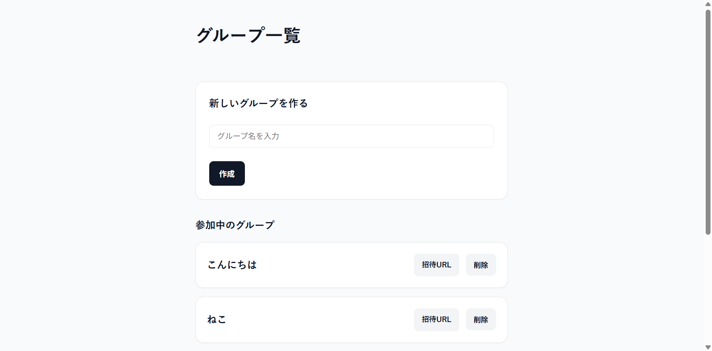
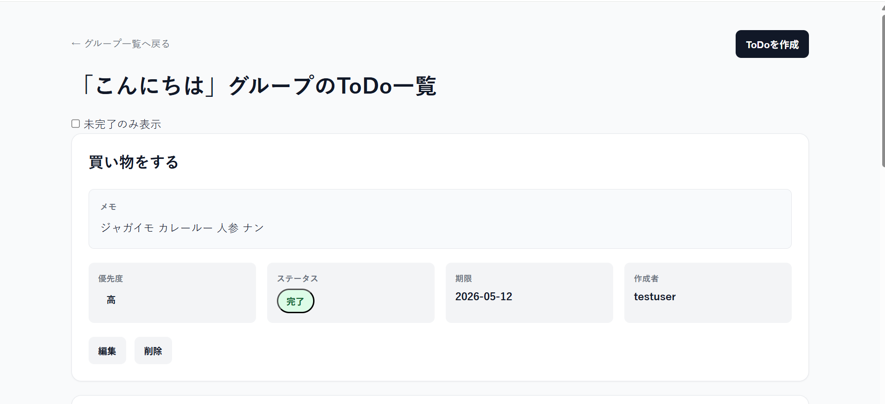

# shared-todo-app

グループでToDoを共有できるWebアプリです。

ToDoの作成・編集・削除・状態管理を、
非同期通信を用いてリアルタイムに反映できます。

## 使用技術

### フロントエンド
- HTML
- CSS
- JavaScript
- Knockout.js

### バックエンド
- PHP
- FuelPHP

### データベース
- MySQL

### 開発環境
- Docker
- Git / GitHub

## 主な機能

- ユーザー認証
- グループ作成
- グループ招待
- ToDo作成
- ToDo編集
- ToDo削除
- 非同期ステータス更新
- 優先度管理
- 期限設定
- 未完了フィルタ
- 優先度・期限順ソート
- トランザクション制御によるデータ整合性維持

## 工夫した点

### 非同期処理の導入
Knockout.js と Fetch API を利用し、
ページリロードなしでToDoを更新できるようにしました。

### ソート処理の共通化
ToDo追加時と編集時で重複していたソート処理を関数化し、
保守性を向上させました。

### 状態管理
observable / computed を活用し、
UIとデータをリアクティブに同期させました。

### セキュリティ対策
セキュリティ対策
- CSRFトークンによる不正リクエスト対策
- JSON_HEX_* を利用したXSS対策
- 状態変更系処理をPOSTへ統一
- グループ招待時の権限チェック実装

## 苦労した点

非同期でToDoを追加した際、
表示順が崩れる問題がありました。

原因を調査した結果、
サーバー側の並び順と、
クライアント側のobservableArrayの並び順が
一致していないことが原因でした。

そのため、
クライアント側でもソート処理を実装し、
表示順を統一しました。

## 今後の改善

- 検索機能
- ドラッグ＆ドロップ並び替え
- ページネーション
- バリデーション強化
- テストコード追加
- TypeScript化
- Vue / React への移行

## ToDo、group一覧画面

## 元の開発スケジュール

着手日：　4/26  
完了日：　5/26  

要件定義：　4/26 ~ 4/27  
設計：　4/28 ~ 4/30  
チェック：　5/1 ~ 5/2  
実装：　5/3 ~ 5/20  
テスト：　5/21 ~ 5/22  
レビュー：　5/23 ~ 5/24  
修正：　5/25 ~ 5/26  
